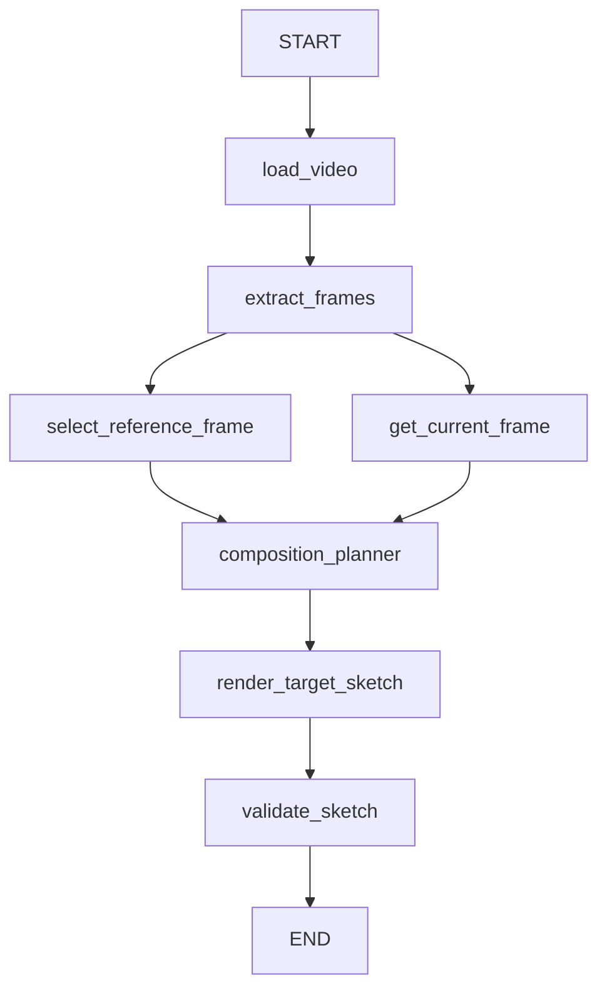

# Photography Viewpoint Agent V0.1

基于 Python + LangGraph 的本地视频构图原型，输出稳定的 `TargetState`、目标草图及执行校验结果。

**当前 V0.1 的 Composition Planner 使用人工输入 TargetState，仅用于验证 Agent Workflow 和 Target Sketch Rendering Pipeline。** 不需要模型、API Key 或模型权重。

## Workflow



两个分支由 LangGraph 并行调度，并通过等待两个分支完成的汇合边进入 Planner；这只是 Workflow 内部并行，不涉及 subagent。`validate_plan()` 在 Planner 中作为普通 Python 函数调用，不是独立 Node。汇合方式参考 [LangGraph add_edge 官方文档](https://reference.langchain.com/python/langgraph/graph/state/StateGraph/add_edge)。

## 安装

Python 3.11+，建议使用独立虚拟环境。Windows PowerShell：

```powershell
python -m venv .venv
.\.venv\Scripts\python -m pip install -r requirements.txt
```

macOS / Linux 使用 `.venv/bin/python` 替代 `.\.venv\Scripts\python`。可选执行 `python -m pip install -e .` 安装包和 `photo-agent` 命令。`requirements-lock.txt` 记录本次验证环境中的精确版本。

## 运行

在项目根目录执行：

```powershell
.\.venv\Scripts\python app.py --video path/to/video.mp4 --target-state examples/manual_target_state.json
```

完整可复现的合成视频演示：

```powershell
.\.venv\Scripts\python examples/create_demo_video.py --output workdir/demo.mp4
.\.venv\Scripts\python app.py --video workdir/demo.mp4 --target-state examples/manual_target_state.json --work-dir workdir/demo-run
```

`--work-dir` 必须不存在或为空；再次运行请使用新的目录（如 `workdir/demo-run-2`），避免旧成功产物与新失败运行混淆。CLI 不自动删除已有文件。

可配置参数：

| 参数 | 默认值 | 含义 |
| --- | --- | --- |
| `--frame-sample-interval` | 30 | 每多少帧采样一次 |
| `--random-seed` | 42 | 可复现的随机参考帧选择 |
| `--target-width` / `--target-height` | 1280 / 720 | 草图像素尺寸 |
| `--subject-position-threshold` | 0.05 | 人物中心距离阈值 |
| `--subject-scale-threshold` | 0.05 | 人物 bbox 高度差阈值 |
| `--framing-threshold` | 0.03 | viewport 四边平均绝对误差阈值 |
| `--work-dir` | `./workdir` | 本次运行输出目录 |

退出码：`0` 校验 PASS；`1` 输入或执行错误；`2` 校验 FAIL。失败时记录日志，在已经成功准备的输出目录保存含 `error` 的 `result.json`。无自动重试或重新渲染。

## 人工 TargetState

```json
{
  "subject": {"bbox": [0.28, 0.15, 0.52, 0.90]},
  "framing": {"reference_viewport": [0.05, 0.02, 0.95, 0.98]}
}
```

所有坐标均为 `[xmin, ymin, xmax, ymax]`，归一化到 `[0, 1]`，左上角为 `(0, 0)`。必须满足 `xmin < xmax`、`ymin < ymax`，拒绝缺失字段、额外字段及 NaN/Inf。

- `subject.bbox`：**最终 Target Canvas** 中的人物目标边界，唯一的人物位置/尺度真值。
- `framing.reference_viewport`：**Reference Frame** 中希望映射到 Target Canvas 的场景区域。

## 实现约定

1. 顺序解码全部视频，但只把间隔采样帧和最后一帧写入磁盘；最后一帧不重复保存。内存中不积累整段视频，State 中只保留路径及 Pydantic 数据。
2. `current_frame` 使用解码得到的最后一帧，无模糊或稳定性筛选。如果解码帧数少于视频声明帧数，报错，避免把提前中断的位置当成最后一帧。OpenCV 无法完全区分损坏视频与正常 EOF，特殊封装可能仍需后续 FFmpeg 支持。
3. 随机选择使用独立的 `random.Random(seed)`，每次选择重新初始化；同一视频、采样设置和 seed 可复现。候选集合包含最后一帧。
4. 基础 Renderer 对 viewport 做向外像素取整、裁剪，再直接 resize 到目标尺寸。宽高比不一致时会拉伸；V0.1 不做自动 letterbox 或额外裁剪。`RenderMeta` 记录实际取整后的 viewport，误差可能不是零。
5. 人物暂不检测、移动或添加假人物；原参考帧中的人物随背景一起裁剪缩放。`rendered_subject_bbox=None`，人物误差为 `None`，并明确提示未启用。PASS 仅表示已实现的 framing 和文件可读性/尺寸检查通过，不表示完整人物构图已达成。
6. Validator 根据 RenderMeta 计算：中心欧氏距离、bbox 高度绝对差、viewport 四边平均绝对误差。它是执行一致性检查，不是视觉美学或独立人物检测模型。

## 输出

```text
workdir/demo-run/
  frames/frame_000000.jpg
  frames/frame_000030.jpg
  ...
  current_frame.jpg
  reference_frame.jpg
  target_sketch.jpg
  result.json
```

`result.json` 包含当前帧/参考帧信息、候选帧元数据、`target_state`、`target_sketch_path`、`render_meta`、`validation` 和 `error`；路径为绝对路径。输出图片均在本次 `work_dir` 下。`target_sketch_path` 指向文档中所说的最终 `target_sketch`。

## 模块结构与替换接口

```text
photography_viewpoint_agent/
  app.py                  CLI / JSON 输出
  config/settings.py      运行配置
  schemas/                状态和业务 Schema
  graph/workflow.py       节点、边、并行汇合和错误包装
  nodes/                  薄节点适配层
  selectors/              ReferenceSelector / Random / API adapter
  planners/               CompositionPlanner / Manual
  renderer/               SketchRenderer / ViewportRenderer
  tools/                  视频抽帧、计划校验、草图校验
examples/                 人工计划 JSON、合成视频脚本
tests/                    单元和集成测试
```

通过依赖注入替换组件，不修改 Graph：

```python
from photography_viewpoint_agent.config.settings import AgentConfig
from photography_viewpoint_agent.graph.workflow import build_workflow
from photography_viewpoint_agent.schemas.target import TargetState
from photography_viewpoint_agent.selectors.api_selector import APIReferenceSelector

# adapter(frames) 负责调用你自己的 API，并返回候选列表中的 frame_id。
# 没有规定 API 地址/鉴权协议，因此不虚构网络服务；未注入时使用 RandomReferenceSelector。
# selector = APIReferenceSelector(adapter)
graph = build_workflow(AgentConfig(work_dir="workdir/python-run"))
target = TargetState.model_validate_json(open("examples/manual_target_state.json", encoding="utf-8").read())
result = graph.invoke({"video_path": "input.mp4", "manual_target_state": target})
if result.get("error"):
    raise RuntimeError(result["error"])
```

`build_workflow(config, selector=..., planner=..., renderer=...)` 接收各自 Protocol 的实现。Python 调用方应为每次调用分配独立 `work_dir` 并自行持久化结果；CLI 已处理目录冲突和结果输出。State 每次传入全新输入，组件实例及 Config 不进入 State。

未来可添加 VLM Planner、真实 Selector API、Renderer 内部人物分割/重定位工具。实时指导应作为下游独立模块，消费 Current/Target State 和图像。当前不实现实时流、3D、SLAM、多人物、AIGC 或闭环。

## 测试

```powershell
.\.venv\Scripts\python -m pytest -q
```

覆盖坐标边界、非法计划、配置校验、随机复现、API 返回值、实际裁剪像素、误差公式、不可读图片、最终帧采样、并行汇合、并行错误合并和 CLI 完整运行。测试自行创建本地视频，无需外部素材或服务。
