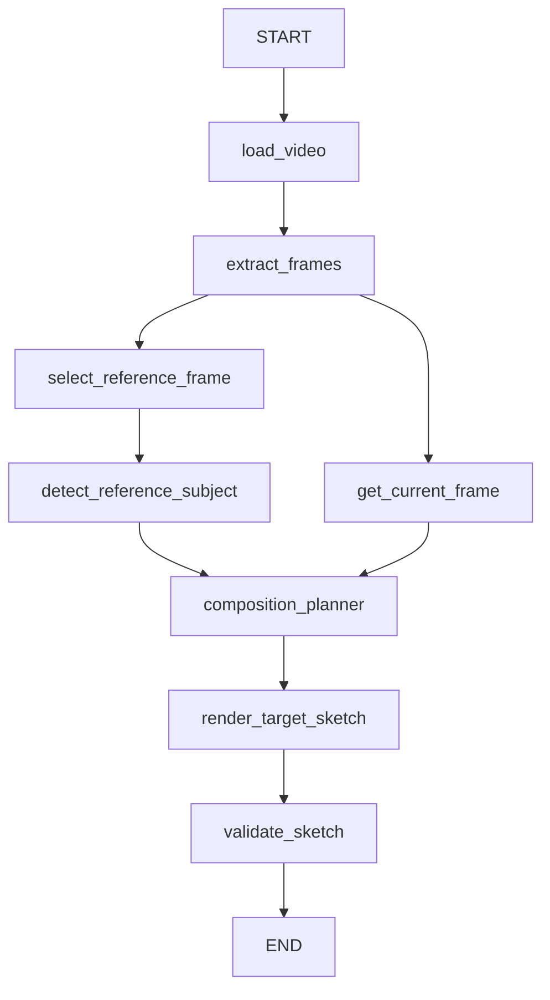

# Photography Viewpoint Agent V0.2

Python + LangGraph 本地视频构图原型。当前版本自动用 YOLO-seg 分离主人物，让 `reference_viewport` 控制背景取景，让 `subject.bbox` 控制人物的移动与等比缩放。

**Composition Planner 仍使用人工输入 TargetState，用于验证 Workflow 和分层 Target Sketch Rendering Pipeline。** 不需要 VLM API 或 Key；首次运行需要下载 YOLO 分割权重。

## Workflow



参考帧分支与当前帧分支并行，Planner 等待检测分支和当前帧分支都完成。`validate_plan()` 是 Planner 中的普通函数。错误记录到 `AgentState.error` 和日志，下游跳过执行，无静默人物回退、重试或循环。

## 安装：Python 3.11+

已在 **Windows / Python 3.11.16 / CPU** 实际安装并完成测试。`requirements-lock.txt` 来自这个环境（NumPy 2.3.5、PyTorch 2.14.0、Ultralytics 8.4.152），不再沿用 Python 3.13 环境的 NumPy 2.5 锁版本。普通安装会按 Python 版本解析适用依赖：

```powershell
py -3.11 -m venv .venv
.\.venv\Scripts\python -m pip install -r requirements.txt
# 或复现本次 Python 3.11 环境：
.\.venv\Scripts\python -m pip install -r requirements-lock.txt
# 可选安装 photo-agent 命令：
.\.venv\Scripts\python -m pip install -e .
```

本次开发机的 Python 3.11 环境名为 `.venv311`，以下命令直接可用。macOS / Linux 使用对应环境的 `bin/python`。只保留一个 OpenCV 发行包 `opencv-python`，与 Ultralytics 依赖一致，避免同时安装 headless 与 GUI 包覆盖 `cv2`。

CPU 默认可运行；服务器使用 CUDA 时，先按 [PyTorch 官方安装说明](https://pytorch.org/get-started/locally/) 安装适配服务器 CUDA 的 PyTorch，再传 `--device cuda`。本次未验证 GPU。

## 真实视频 Demo

```powershell
.\.venv311\Scripts\python app.py --video "D:\Data\videoagent\test_data\PhotoAgent\mixkit-children-skiing-on-the-plain-of-a-pine-forest-3349-full-hd.mp4" --target-state examples/subject_move_left.json --work-dir workdir/my-subject-demo --device cpu --debug
```

另一组背景扩面 + 人物右移并使用较小目标区域：

```powershell
.\.venv311\Scripts\python app.py --video "D:\Data\videoagent\test_data\PhotoAgent\mixkit-children-skiing-on-the-plain-of-a-pine-forest-3349-full-hd.mp4" --target-state examples/subject_zoom_out_right.json --work-dir workdir/my-subject-expanded --device cpu --debug
```

`--work-dir` 必须为空或不存在，每次选择新目录，避免旧成功产物与失败运行混淆。退出码：`0` PASS，`1` 输入/检测/执行错误，`2` 校验 FAIL。

主要配置：

| CLI 参数 | 默认值 | 作用 |
| --- | --- | --- |
| `--yolo-model` | `yolo11n-seg.pt` | 分割模型名称或本地权重路径 |
| `--person-confidence` | 0.4 | 人物检测最低置信度 |
| `--device` | `cpu` | 推理设备，可用 `cuda` |
| `--debug` | 关闭 | 保存背景、RGBA 主体中间产物 |
| `--frame-sample-interval` | 30 | 每多少帧采样一次 |
| `--random-seed` | 42 | 可复现参考帧选择 |
| `--target-width` / `--target-height` | 1280 / 720 | 输出画布大小 |
| `--fill-color R G B` | 128 128 128 | 扩面填充颜色 |
| `--subject-position-threshold` | 0.05 | 人物底部中心误差阈值 |
| `--subject-scale-threshold` | 0.05 | contain 后预期高度的误差阈值 |
| `--framing-threshold` | 0.03 | 比例适配后的 viewport 误差阈值 |

YOLO 模型通过 Ultralytics 首次使用的标准行为下载，无自定义下载器。离线运行请传本地 `.pt` 路径；权重、环境、演示输出均由 `.gitignore` 排除。检测参考 [Ultralytics segmentation](https://docs.ultralytics.com/tasks/segment/) 和 [predict 参数](https://docs.ultralytics.com/modes/predict/)。

## Schema 与职责

```json
{
  "subject": {"bbox": [0.12, 0.20, 0.35, 0.85]},
  "framing": {"reference_viewport": [0.0, 0.0, 1.0, 1.0]}
}
```

坐标格式均为 `[xmin, ymin, xmax, ymax]`，左上角为 `(0,0)`。

- **TargetState = 目标**：`subject.bbox` 是最终画布中的 target envelope，仍满足 `0 <= min < max <= 1`；`reference_viewport` 是原图归一化坐标系中的虚拟视窗，可超出 `[0,1]`。所有值及宽高必须 finite。取消旧的可选 `[-2,3]` 限制，避免合法的比例补偿扩面受阻。
- **SubjectObservation = 感知**：`bbox`、`mask_path`、`confidence`。bbox 使用所选人物二值 mask 的紧边界，便于精确提取和比例校验；不直接使用可能带空白的检测框。mask 是与参考图等大的 PNG，State 只存路径，不存数组。
- **Renderer = 执行**：负责移除人物、填补背景、两个图层的独立几何变换与合成，不负责运行 YOLO。
- **RenderMeta = 实际结果**：`rendered_viewport` 为比例适配后的真实视窗；`rendered_subject_bbox` 从最终人物图层 alpha 的非零像素测得；`source_subject_bbox` 为原人物 mask 边界；`reference_size` 为原图像素宽高；`padding` 为背景画布填充边距（左、上、右、下）。人物可覆盖 padding，它不代表最终合成图仍完全为空的区域。

## 人物检测与分层

`subject_detection/YOLOSubjectDetector` 实现可替换的 `SubjectDetector` 接口，由 `detect_reference_subject` 节点调用。使用 `classes=person`、`retina_masks=True`，确保 mask 与原图尺寸一致。

多人时先找最大检测框面积；面积达到最大值 90% 的候选视为接近，再选离画面中心最近者。只操作选中的一个人，其他人留在背景。无人物、缺失/空 mask、尺寸不一致、非法 bbox 都返回明确错误。

人物图层 RGB 来自参考图、alpha 来自二值 mask，不使用额外 matting。背景先对 mask 用 7×7 椭圆核膨胀（半径约 3 像素），再执行 `cv2.inpaint(..., 3, INPAINT_TELEA)`，对填补区边缘做轻量高斯混合。不存在可用背景像素时报告错误。

## 人物等比缩放与定位

将人物按 mask 紧边界裁成 RGBA 图层。设人物大小为 `sw × sh`，目标 envelope 像素大小为 `ew × eh`：

```text
s = min(ew/sw, eh/sh)
left = envelope_center_x - sw*s/2
top = envelope_bottom - sh*s
```

通过同一个 `s` 的逆仿射映射输出到固定画布，不分别拉伸宽高。人物水平居中、底部贴齐 envelope；实际 bbox 可以窄于或矮于目标区域。画布边界天然裁切，极小目标导致完全无可见像素时明确报错。

## 背景比例修正

必须使用**源像素宽高比**：

```text
viewport_pixel_ratio = ((xmax-xmin)*reference_width) / ((ymax-ymin)*reference_height)
canvas_ratio = canvas_width / canvas_height
```

直接比较归一化宽高比会误判非正方形原图，因此实现中乘上参考图的宽高。

- viewport 完全在原图内部：保持中心，太宽则左右对称收缩，太高则上下对称收缩，直到匹配画布。
- viewport 已超出原图：保持中心，扩大较短方向，保留请求区域并补齐比例。
- 适配后，背景和人物都通过单一缩放系数的仿射变换采样到画布。超出原图的位置填单色，不创建巨大扩面中间图。

这会有意改变旧版比例不匹配时的拉伸行为，以及对应 padding。完整 16:9 原图到 16:9 画布仍保持完整原图；当画布比例不同，按上述策略适配。边界允许亚像素位置，实际图像边界有约一个像素的栅格离散误差。

原图坐标映射在**适配后 viewport** 上仍满足：

```text
target_x = (x-xmin)/(xmax-xmin)
target_y = (y-ymin)/(ymax-ymin)
```

旧示例 `viewport_crop.json`、`viewport_expansion.json`、`viewport_left_expansion.json` 仍可使用；现在运行完整流程会同时检测并摆放人物。

## Validator

- Position：目标 envelope 与实际人物 bbox 的 **bottom-center** 欧氏距离。
- Scale：从 `source_subject_bbox` + `reference_size` 推导等比 contain 后应有的高度，与实际 bbox 高度比较。窄 envelope 导致人物达不到 envelope 全高是预期行为，输出解释信息，不因此误判 FAIL。
- 额外检查人物未超出 envelope、人物比例未变形，允许像素离散误差。
- Framing：从目标 viewport 和原图/画布大小重新计算应有的比例适配，比较实际 viewport 的四边平均绝对误差；适配发生时输出说明，不把必要裁剪误判为执行失败。
- 检查输出文件可读及大小一致。完整流程缺失人物渲染结果会 FAIL。

验证使用几何与渲染元数据，不是独立的语义检测或美学评价；PASS 不保证人物分割准确或背景填补自然。

## 输出文件

```text
workdir/my-subject-demo/
  frames/frame_*.jpg
  reference_frame.jpg
  current_frame.jpg
  subject_mask.png
  target_sketch.jpg
  result.json
  background_without_subject.jpg   # --debug
  background_canvas.jpg            # --debug
  subject_layer.png                # --debug
  placed_subject.png               # --debug
```

`result.json` 保存原始 TargetState、检测结果、参考帧/当前帧、实际 RenderMeta、validation 和 error。当前帧始终是顺序解码的最后一帧；抽帧不会重复存最后一帧。元数据声明帧数大于解码帧数时按提前结束报错。参考帧仍按固定 seed 随机选择，不是模型判断的最佳视角。

## 代码结构与替换接口

| 文件 / 模块 | 职责 |
| --- | --- |
| `schemas/subject.py`、`schemas/state.py` | SubjectObservation 与 reference_subject 状态 |
| `schemas/target.py`、`schemas/base.py` | 目标坐标约束 |
| `schemas/rendering.py` | 实际人物/背景几何元数据 |
| `subject_detection/base.py`、`subject_detection/yolo.py` | 可替换检测器、YOLO 实现、主人物选择 |
| `nodes/detect_reference_subject.py`、`graph/workflow.py` | 感知节点与并行汇合 |
| `renderer/target_sketch.py` | 图层处理与合成编排 |
| `renderer/viewport.py`、`tools/geometry.py` | 比例适配与统一背景映射 |
| `tools/subject_utils.py` | mask、RGBA、CV 背景填补、人物摆放与合成 |
| `renderer/base.py`、`nodes/render_sketch.py` | Renderer 接口接入 reference_subject |
| `tools/sketch_validator.py` | bottom-center、contain scale、比例与 framing 校验 |
| `config/settings.py`、`app.py` | 模型、设备、阈值、debug 配置和 CLI |
| `requirements*.txt`、`pyproject.toml`、`.gitignore` | Python 3.11 依赖与权重排除 |
| `tests/`、`examples/subject_*.json` | 离线自动测试与真实演示参数 |

`build_workflow(config, selector=..., planner=..., detector=..., renderer=...)` 使用 Protocol 注入组件，不改变 Selector/Planner 的职责。Renderer 接口为 `render(reference_frame, reference_subject, target_state, output_path)`。配置和模型实例不进入 State；每次 Python 调用使用独立 work_dir。

## 测试与实际观察

```powershell
.\.venv311\Scripts\python -m pytest -q
```

自动测试不下载模型：检测适配器使用 fixture，集成测试注入检测结果。覆盖无人物、空/错误 mask、主人物选择、不移动、左移、缩小、放大、宽/窄 envelope、底部对齐、原人物清除、背景 crop/expansion 比例、图层独立变换、错误校验，以及此前视频/Schema/Selector/Graph/CLI 测试。旧拉伸预期已替换为本阶段的保比例预期。

CPU 真实测试采用用户的滑雪视频，YOLO 自动选中前景滑雪者，两组结果均 PASS。**实际局限**：person 类 mask 不包含滑雪板，滑雪板留在原处；分割边缘可见白边，传统 inpaint 在树木/雪地交界及鞋底附近留下涂抹痕迹。人物可按目标参数落在灰色占位区，系统暂不检查地面接触关系。

当前不实现器材关联、SAM、高级 matting、生成式补图、阴影/反射/遮挡重建、姿态修改、多人物规划、3D、实时闭环或美学优化。
