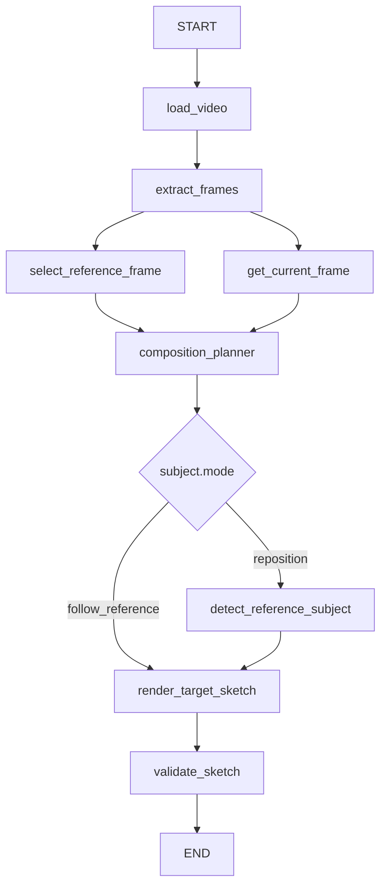

# Photography Viewpoint Agent V0.3

Python + LangGraph 本地视频构图原型。`reference_viewport` 控制整体取景，`subject.mode` 明确选择整图跟随或人物独立编辑。只有 `reposition` 使用 YOLO-seg 和目标 `subject.bbox`。

**Composition Planner 仍使用人工输入 TargetState，用于验证 Workflow 和 Target Sketch Rendering Pipeline。** 不需要 VLM API 或 Key；只有首次运行 `reposition` 才需要下载 YOLO 分割权重。`follow_reference` 不加载模型。

## Workflow



参考帧与当前帧分支并行，并在 Planner 汇合；`validate_plan()` 仍是普通函数。Planner 产出合法计划后才根据 mode 走条件边，因此不依赖人工输入的原始 mode，也适用于未来可替换的 Planner。`follow_reference` 完全跳过检测节点，不会因无人物、权重缺失或 YOLO 失败被阻塞；`reposition` 检测失败仍写入 `AgentState.error` 并停止后续业务执行，无静默回退。

## 安装：Python 3.11+

已在 **Windows / Python 3.11.16 / CPU** 实际安装并完成测试。`requirements-lock.txt` 来自这个环境（NumPy 2.3.5、PyTorch 2.14.0、Ultralytics 8.4.152），不再沿用 Python 3.13 环境的 NumPy 2.5 锁版本。普通安装会按 Python 版本解析适用依赖：

```powershell
py -3.11 -m venv .venv
.\.venv\Scripts\python -m pip install -r requirements.txt
# 或复现本次 Python 3.11 环境：
.\.venv\Scripts\python -m pip install -r requirements-lock.txt
# 可选安装 photo-agent 命令：
.\.venv\Scripts\python -m pip install -e .
```

本次开发机的 Python 3.11 环境名为 `.venv311`，以下命令直接可用。macOS / Linux 使用对应环境的 `bin/python`。只保留一个 OpenCV 发行包 `opencv-python`，与 Ultralytics 依赖一致，避免同时安装 headless 与 GUI 包覆盖 `cv2`。

CPU 默认可运行；服务器使用 CUDA 时，先按 [PyTorch 官方安装说明](https://pytorch.org/get-started/locally/) 安装适配服务器 CUDA 的 PyTorch，再传 `--device cuda`。本次未验证 GPU。

## 真实视频 Demo

**整图跟随，不独立编辑人物：**

```powershell
.\.venv311\Scripts\python app.py --video "D:\Data\videoagent\test_data\PhotoAgent\mixkit-children-skiing-on-the-plain-of-a-pine-forest-3349-full-hd.mp4" --target-state examples/11_frame_only__zoom_out_center.json --work-dir workdir/my-follow-demo --device cpu --debug
```

**同样的背景视窗，同时人物右移并缩小：**

```powershell
.\.venv311\Scripts\python app.py --video "D:\Data\videoagent\test_data\PhotoAgent\mixkit-children-skiing-on-the-plain-of-a-pine-forest-3349-full-hd.mp4" --target-state examples/31_combined__frame_zoom_out__subject_right_smaller.json --work-dir workdir/my-reposition-demo --device cpu --debug
```

`--work-dir` 必须为空或不存在，每次选择新目录，避免旧成功产物与失败运行混淆。退出码：`0` PASS，`1` 输入/检测/执行错误，`2` 校验 FAIL。

主要配置：

| CLI 参数 | 默认值 | 作用 |
| --- | --- | --- |
| `--yolo-model` | `yolo11n-seg.pt` | 分割模型名称或本地权重路径 |
| `--person-confidence` | 0.4 | 人物检测最低置信度 |
| `--device` | `cpu` | 推理设备，可用 `cuda` |
| `--debug` | 关闭 | 保存背景、RGBA 主体中间产物 |
| `--frame-sample-interval` | 30 | 每多少帧采样一次 |
| `--random-seed` | 42 | 可复现参考帧选择 |
| `--target-width` / `--target-height` | 1280 / 720 | 输出画布大小 |
| `--fill-color R G B` | 128 128 128 | 扩面填充颜色 |
| `--subject-position-threshold` | 0.05 | 人物底部中心误差阈值 |
| `--subject-scale-threshold` | 0.05 | contain 后预期高度的误差阈值 |
| `--framing-threshold` | 0.03 | 比例适配后的 viewport 误差阈值 |
| `--subject-noop-position-threshold` | 0.001 | no-op 底部中心距离阈值，归一化坐标 |
| `--subject-noop-scale-threshold` | 0.001 | no-op 宽/高差最大值阈值，归一化坐标 |

YOLO 模型通过 Ultralytics 首次使用的标准行为下载，无自定义下载器。离线运行请传本地 `.pt` 路径；权重、环境、演示输出均由 `.gitignore` 排除。检测参考 [Ultralytics segmentation](https://docs.ultralytics.com/tasks/segment/) 和 [predict 参数](https://docs.ultralytics.com/modes/predict/)。

## Schema 与职责

```json
{
  "subject": {"mode": "reposition", "bbox": [0.12, 0.20, 0.35, 0.85]},
  "framing": {"reference_viewport": [0.0, 0.0, 1.0, 1.0]}
}
```

坐标格式均为 `[xmin, ymin, xmax, ymax]`，左上角为 `(0,0)`。

`SubjectTarget.mode` **必须显式填写**，仅允许 `follow_reference` / `reposition`。前者要求 bbox 为 null（可省略，默认 null），后者要求合法 bbox。旧版只有 bbox 的 JSON 会被拒绝：要保留原编辑行为请加 `"mode": "reposition"`；只调取景请用 `{"mode":"follow_reference","bbox":null}`，不能用零面积 bbox 代替模式。

- **TargetState = 目标**：`subject.bbox` 仅在 reposition 下使用，是最终画布中的 target envelope，满足 `0 <= min < max <= 1`；`reference_viewport` 是原图归一化坐标系中的虚拟视窗，可超出 `[0,1]`，所有值及宽高必须 finite。
- **SubjectObservation = 感知**：`bbox`、`mask_path`、`confidence`。bbox 使用所选人物二值 mask 的紧边界，便于精确提取和比例校验；不直接使用可能带空白的检测框。mask 是与参考图等大的 PNG，State 只存路径，不存数组。
- **Renderer = 执行**：根据 mode 和 no-op 判断选择完整图变换或分层编辑，不负责运行 YOLO。
- **RenderMeta = 实际结果**：保留 `reference_size`、`padding`；新增 `requested_viewport`（请求）、`subject_mode`（原始意图）、`subject_transform_applied`（实际是否独立编辑）、`natural_subject_bbox`。`rendered_viewport` 始终表示比例适配后的实际视窗。人物可覆盖背景 padding，它不代表最终合成图仍完全为空的区域。

### 四种人物 bbox

| 名称 | 含义与坐标系 |
| --- | --- |
| Source | 参考图中的人物 mask 紧边界，归一化到参考图 |
| Natural | Source 仅经过**实际 rendered viewport** 后的完整投影边界，归一化到目标画布，可超出 `[0,1]` |
| Target | Planner 指定的主动重新布局区域，仅 reposition 有值，位于画布内部 |
| Rendered | 实际编辑时从人物图层 alpha 非零像素测得；整图跟随/no-op 时为 Natural 与画布的几何交集 |

`transform_bbox_by_viewport(source_bbox, effective_viewport)` 对四边分别应用 `(x-xmin)/(xmax-xmin)`、`(y-ymin)/(ymax-ymin)`。Natural 不裁切，便于判断人物原本是否超出画布；Rendered 在人物完全移出视野时为 null，绝不用零面积 bbox。跟随时的交集是几何边界推导，局部裁切的不规则 mask 可能使其略大于真实可见像素紧边界。

默认 follow-reference Graph 不做检测，因此三个感知/执行 bbox 为 null。直接调用 Renderer 时若已有 `reference_subject`，则计算 Natural 和 Rendered，但不会读取 mask 文件；没有检测结果时不虚构人物位置。

### 跟随与 no-op fast path

`follow_reference` 只调用完整参考图的 uniform viewport transform，不读 mask、不提取人物、不 inpaint、不重新粘贴；人物、器材与背景始终使用相同映射。

`reposition` 在 YOLO 检测后，将 Source 按目标 envelope 做 contain + bottom-center，计算**预期实际 bbox**，再与 Natural 比较：底部中心欧氏距离，以及宽/高差的最大值分别不超过配置阈值才命中 no-op。这样宽 envelope 中正确容纳的人物也能避免无意义编辑。人物必须完全可见；Natural 任一坐标超出 `[0,1]` 时不启用 no-op，避免把被裁切人物误当成完整人物。

命中 no-op 后直接复用完整参考图变换，保留 `subject_mode="reposition"`，并记录 `subject_transform_applied=false`。此优化避免分层/填补/合成，**不会省掉用于获得 Source 的 YOLO-seg 推理**。检测器必须保证所提供的 observation 正确；该快速路径不重新读取 mask 校验。

## 人物检测与分层

`subject_detection/YOLOSubjectDetector` 实现可替换的 `SubjectDetector` 接口，仅由 reposition 路径的 `detect_reference_subject` 节点调用。使用 `classes=person`、`retina_masks=True`，确保 mask 与原图尺寸一致。

多人时先找最大检测框面积；面积达到最大值 90% 的候选视为接近，再选离画面中心最近者。只操作选中的一个人，其他人留在背景。无人物、缺失/空 mask、尺寸不一致、非法 bbox 都返回明确错误。

人物图层 RGB 来自参考图、alpha 来自二值 mask，不使用额外 matting。背景先对 mask 用 7×7 椭圆核膨胀（半径约 3 像素），再执行 `cv2.inpaint(..., 3, INPAINT_TELEA)`，对填补区边缘做轻量高斯混合。不存在可用背景像素时报告错误。

## 人物等比缩放与定位

将人物按 mask 紧边界裁成 RGBA 图层。设人物大小为 `sw × sh`，目标 envelope 像素大小为 `ew × eh`：

```text
s = min(ew/sw, eh/sh)
left = envelope_center_x - sw*s/2
top = envelope_bottom - sh*s
```

通过同一个 `s` 的逆仿射映射输出到固定画布，不分别拉伸宽高。人物水平居中、底部贴齐 envelope；实际 bbox 可以窄于或矮于目标区域。画布边界天然裁切，极小目标导致完全无可见像素时明确报错。

## 背景比例修正

必须使用**源像素宽高比**：

```text
viewport_pixel_ratio = ((xmax-xmin)*reference_width) / ((ymax-ymin)*reference_height)
canvas_ratio = canvas_width / canvas_height
```

直接比较归一化宽高比会误判非正方形原图，因此实现中乘上参考图的宽高。

- viewport 完全在原图内部：保持中心，太宽则左右对称收缩，太高则上下对称收缩，直到匹配画布。
- viewport 已超出原图：保持中心，扩大较短方向，保留请求区域并补齐比例。
- 适配后，背景和人物都通过单一缩放系数的仿射变换采样到画布。超出原图的位置填单色，不创建巨大扩面中间图。

这会有意改变旧版比例不匹配时的拉伸行为，以及对应 padding。完整 16:9 原图到 16:9 画布仍保持完整原图；当画布比例不同，按上述策略适配。边界允许亚像素位置，实际图像边界有约一个像素的栅格离散误差。

原图坐标映射在**适配后 viewport** 上仍满足：

```text
target_x = (x-xmin)/(xmax-xmin)
target_y = (y-ymin)/(ymax-ymin)
```

示例已按 `00_baseline`、`10–14_frame_only`、`20–23_subject_only`、`30–31_combined` 四组整理，参见 [examples 中文索引](examples/README.md)。文件名直接说明编辑对象和操作；旧的重复示例已删除。人物单独编辑案例基于当前滑雪视频的第 30 帧校准，换视频后请调整 bbox。

## Validator

- 按 mode 分支：follow-reference 主要验证 framing 和文件，不要求目标 bbox 或检测结果；有 observation 时验证 Natural 投影和 Rendered 可见边界。人物误差保持 null。
- reposition 保留下面的 position / scale 校验，缺失人物结果仍 FAIL；no-op 额外验证跳过编辑是否满足对应阈值，且 Rendered 与 Natural 一致。
- 验证元数据的 mode、requested viewport 与计划一致，follow-reference 不允许记录为已执行人物独立变换。

- Position：目标 envelope 与实际人物 bbox 的 **bottom-center** 欧氏距离。
- Scale：从 `source_subject_bbox` + `reference_size` 推导等比 contain 后应有的高度，与实际 bbox 高度比较。窄 envelope 导致人物达不到 envelope 全高是预期行为，输出解释信息，不因此误判 FAIL。
- 额外检查人物未超出 envelope、人物比例未变形，允许像素离散误差。
- Framing：从目标 viewport 和原图/画布大小重新计算应有的比例适配，比较实际 viewport 的四边平均绝对误差；适配发生时输出说明，不把必要裁剪误判为执行失败。
- 两种模式都检查输出文件可读及大小一致。

验证使用几何与渲染元数据，不是独立的语义检测或美学评价；PASS 不保证人物分割准确或背景填补自然。

## 输出文件

```text
workdir/my-subject-demo/
  frames/frame_*.jpg
  reference_frame.jpg
  current_frame.jpg
  subject_mask.png                 # 仅 reposition 检测生成
  target_sketch.jpg
  result.json
  background_without_subject.jpg   # --debug 且真正编辑人物
  background_canvas.jpg            # --debug 且真正编辑人物
  subject_layer.png                # --debug 且真正编辑人物
  placed_subject.png               # --debug 且真正编辑人物
```

`result.json` 保存原始 TargetState、检测结果、参考帧/当前帧、实际 RenderMeta、validation 和 error。当前帧始终是顺序解码的最后一帧；抽帧不会重复存最后一帧。元数据声明帧数大于解码帧数时按提前结束报错。参考帧仍按固定 seed 随机选择，不是模型判断的最佳视角。

## 代码结构与替换接口

| 文件 / 模块 | 职责 |
| --- | --- |
| `schemas/subject.py`、`schemas/state.py` | SubjectObservation 与 reference_subject 状态 |
| `schemas/target.py`、`schemas/base.py` | 目标坐标约束 |
| `schemas/rendering.py` | 实际人物/背景几何元数据 |
| `subject_detection/base.py`、`subject_detection/yolo.py` | 可替换检测器、YOLO 实现、主人物选择 |
| `nodes/detect_reference_subject.py`、`graph/workflow.py` | 感知节点与并行汇合 |
| `renderer/target_sketch.py` | 图层处理与合成编排 |
| `renderer/viewport.py`、`tools/geometry.py` | 比例适配与统一背景映射 |
| `tools/subject_utils.py` | mask、RGBA、CV 背景填补、人物摆放与合成 |
| `renderer/base.py`、`nodes/render_sketch.py` | Renderer 接口接入 reference_subject |
| `tools/sketch_validator.py` | bottom-center、contain scale、比例与 framing 校验 |
| `config/settings.py`、`app.py` | 模型、设备、阈值、debug 配置和 CLI |
| `requirements*.txt`、`pyproject.toml`、`.gitignore` | Python 3.11 依赖与权重排除 |
| `tests/`、`examples/*.json` | 离线自动测试与真实演示参数 |

`build_workflow(config, selector=..., planner=..., detector=..., renderer=...)` 使用 Protocol 注入组件，不改变 Selector/Planner 的职责。Renderer 接口仍为 `render(reference_frame, reference_subject, target_state, output_path)`，其中 reference_subject 在 follow-reference 下可以为 None。配置和模型实例不进入 State；每次 Python 调用使用独立 work_dir 和全新输入 State。

## 测试与实际观察

```powershell
.\.venv311\Scripts\python -m pytest -q
```

自动测试不下载模型：检测适配器使用 fixture，集成测试注入检测结果。覆盖无人物、空/错误 mask、主人物选择、不移动、左移、缩小、放大、宽/窄 envelope、底部对齐、原人物清除、背景 crop/expansion 比例、图层独立变换、错误校验，以及此前视频/Schema/Selector/Graph/CLI 测试。旧拉伸预期已替换为本阶段的保比例预期。

V0.3 新增 `tests/test_subject_modes.py` 及 Schema/Workflow 测试：严格 mode/bbox 组合、整图不变/crop/expansion 的逐像素结果、编辑工具调用禁令、检测失败仍可 follow、无效模型路径 CLI、Natural 的非对称/比例修正/裁切投影、精确/近似/宽 envelope no-op、明显位置与尺度变化拒绝 no-op、错误元数据验证。所有示例 JSON 都纳入 Schema 测试。

CPU 真实测试采用用户的滑雪视频：follow-reference、正常 reposition、reposition no-op 均 PASS；no-op 与同 viewport 的 follow-reference 输出 JPEG **逐字节一致**。跟随模式使用不存在的模型路径仍成功，无 mask/inpaint 产物。**独立编辑的局限仍然存在**：person 类 mask 不包含滑雪板，滑雪板留在原处；分割边缘可见白边，传统 inpaint 留下涂抹痕迹。跟随/no-op 路径不引入这些编辑痕迹。人物可按目标参数落在灰色占位区，系统暂不检查地面接触关系。

当前不实现器材关联、SAM、高级 matting、生成式补图、阴影/反射/遮挡重建、姿态修改、多人物规划、3D、实时闭环或美学优化。

## 基于深度的小范围3D机位编辑

正式 workflow 现支持 `viewpoint.mode=depth_3d`，保留原 none / rotation。
新增案例 `50_depth3d__identity`、`51_depth3d__translate_right_small`、`52_depth3d__translate_forward_small`、`53_depth3d__translate_backward_small`、`54_combined__depth3d__zoom_in__subject_right`、`55_depth3d__translate_up_small`。
完整运行方法、CPU深度模型、坐标方向与验收结果见 [depth_3d说明](docs/depth3d.md)。
